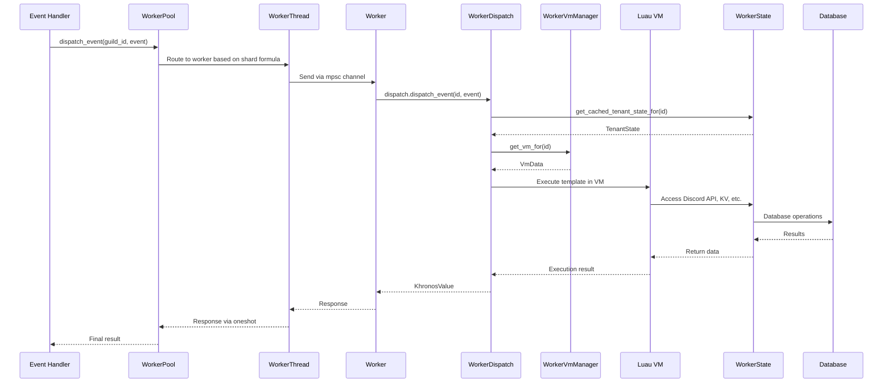

## Core Worker Components

### WorkerVmManager

Manages the lifecycle of Luau VMs for each tenant (guild or user).

```rust
pub struct WorkerVmManager {
    worker_state: WorkerState,
    vms: Rc<RefCell<HashMap<Id, VmData>>>
}
```

Reference: src/worker/workervmmanager.rs:96-101

<AccordionGroup>
  <Accordion title="VM Creation">
    Creates a new Luau VM with configured runtime limits:
    
    ```rust
    fn create_vm(&self) -> LuaResult<VmData> {
        let runtime = KhronosRuntime::new(
            RuntimeCreateOpts {
                disable_task_lib: false,
                time_limit: Some(MAX_TEMPLATES_EXECUTION_TIME),
                give_time: TEMPLATE_GIVE_TIME
            },
            None,
            vfs::OverlayFS::new(&vec![
                vfs::EmbeddedFS::<BuiltinsPatches>::new().into(),
                vfs::EmbeddedFS::<Builtins>::new().into(),
                vfs::EmbeddedFS::<TemplatingTypes>::new().into(),
            ])
        )?;
        
        runtime.set_memory_limit(MAX_TEMPLATE_MEMORY_USAGE)?;
        
        Ok(VmData { state, runtime, kv_constraints, ratelimits })
    }
    ```
    
    Reference: src/worker/workervmmanager.rs:131-144
    
    **Limits Applied:**
    - Execution time limit (MAX_TEMPLATES_EXECUTION_TIME)
    - Memory limit (MAX_TEMPLATE_MEMORY_USAGE)
    - Rate limits via GCRA algorithm
    - KV constraints (key/value size limits)
  </Accordion>
  
  <Accordion title="VM Retrieval">
    Lazy VM creation - VMs are created on first use:
    
    ```rust
    pub fn get_vm_for(&self, id: Id) -> LuaResult<VmData> {
        let mut vms = self.vms.borrow_mut();
        if let Some(vm) = vms.get(&id) {
            return Ok(vm.clone());
        }
        
        let vm = self.create_vm()?;
        vms.insert(id, vm.clone());
        Ok(vm)
    }
    ```
    
    Reference: src/worker/workervmmanager.rs:118-128
  </Accordion>
  
  <Accordion title="VM Removal">
    Cleans up VM resources and marks runtime as broken:
    
    ```rust
    pub fn remove_vm_for(&self, id: Id) -> Result<(), crate::Error> {
        let cell_opt = self.vms.borrow_mut().remove(&id);
        
        if let Some(vm) = cell_opt {
            vm.runtime.mark_broken(true)?;
        }
        
        Ok(())
    }
    ```
    
    Reference: src/worker/workervmmanager.rs:147-158
  </Accordion>
</AccordionGroup>

**Key Methods:**
- `get_vm_for(id)`: Get or create VM for tenant
- `remove_vm_for(id)`: Remove and cleanup VM
- `len()`: Number of managed VMs
- `keys()`: List of all tenant IDs with VMs

### WorkerDispatch

Handles event dispatching to Luau VMs with error handling and lifecycle management.

```rust
pub struct WorkerDispatch {
    vm_manager: WorkerVmManager,
}
```

Reference: src/worker/workerdispatch.rs:10-13

<AccordionGroup>
  <Accordion title="Event Dispatch Flow">
    1. **Check Tenant State**: Verify event is registered for tenant
    2. **Get VM**: Retrieve or create VM via WorkerVmManager
    3. **Load Template**: Execute `./builtins.templateloop` script
    4. **Create Context**: Build TemplateContextProvider with event data
    5. **Execute**: Run in Khronos scheduler
    6. **Error Handling**: Log errors to Discord error channel
    
    ```rust
    pub async fn dispatch_event(&self, id: Id, event: CreateEvent) -> mlua::Result<KhronosValue> {
        let tenant_state = self.vm_manager.worker_state().get_cached_tenant_state_for(id)?;
        
        if !tenant_state.events.contains(event.name()) {
            return Ok(KhronosValue::Null);
        }
        
        let vm_data = self.vm_manager.get_vm_for(id)?;
        
        if vm_data.runtime.is_broken() {
            return Err(mlua::Error::external("Lua VM to dispatch to is broken"));
        }
        
        let func = vm_data.runtime.eval_script("./builtins.templateloop")?;
        let provider = TemplateContextProvider::new(id, vm_data.clone());
        let context = vm_data.runtime.create_context(provider, event)?;
        
        match vm_data.runtime.call_in_scheduler::<_, KhronosValue>(func, context).await {
            Ok(result) => Ok(result),
            Err(e) => {
                tokio::task::spawn_local(async move {
                    Self::log_error_to_main_server(&vm_data, err_str).await
                });
                Err(e)
            },
        }
    }
    ```
    
    Reference: src/worker/workerdispatch.rs:72-111
  </Accordion>
  
  <Accordion title="Startup Events">
    Automatically dispatches `OnStartup` events to registered tenants:
    
    ```rust
    pub fn dispatch_startup_events(&self) {
        let ids = self.vm_manager.worker_state().get_startup_event_tenants();
        for id in ids.iter() {
            let event = CreateEvent::new("OnStartup".to_string(), None, json!({
                "reason": "worker_startup"
            }));
            
            tokio::task::spawn_local(async move {
                self.dispatch_event(id, event).await
            });
        }
    }
    ```
    
    Called automatically during WorkerDispatch creation (src/worker/workerdispatch.rs:16-24)
    
    Reference: src/worker/workerdispatch.rs:27-46
  </Accordion>
  
  <Accordion title="Script Execution">
    Runs arbitrary Luau code for staff API:
    
    ```rust
    pub async fn run_script(&self, id: Id, name: String, code: String, event: CreateEvent) -> mlua::Result<KhronosValue> {
        let vm_data = self.vm_manager.get_vm_for(id)?;
        
        if vm_data.runtime.is_broken() {
            return Err(mlua::Error::external("Lua VM to dispatch to is broken"));
        }
        
        let func = vm_data.runtime.eval_chunk(&code, Some(&name), None)?;
        let provider = TemplateContextProvider::new(id, vm_data.clone());
        let context = vm_data.runtime.create_context(provider, event)?;
        
        vm_data.runtime.call_in_scheduler::<_, KhronosValue>(func, context).await
    }
    ```
    
    Reference: src/worker/workerdispatch.rs:49-69
  </Accordion>
</AccordionGroup>

### WorkerState

Shared state across all VMs in a worker including HTTP clients, database access, and tenant state cache.

```rust
pub struct WorkerState {
    pub serenity_http: Arc<serenity::http::Http>,
    pub _reqwest_client: reqwest::Client,
    pub object_store: Arc<ObjectStore>,
    pub mesophyll_db: Arc<WorkerDB>,
    pub current_user: Arc<serenity::all::CurrentUser>,
    pub sandwich: Sandwich,
    pub worker_print: bool,
    tenant_state_cache: Rc<RefCell<HashMap<Id, TenantState>>>,
}
```

Reference: src/worker/workerstate.rs:60-69

<CardGroup cols={2}>
  <Card title="Tenant State Cache" icon="database">
    In-memory cache of which events are registered for each tenant. Acts as a routing table to avoid dispatching unregistered events.
    
    ```rust
    pub fn get_cached_tenant_state_for<'a>(&'a self, id: Id) -> Result<Cow<'a, TenantState>, crate::Error>
    pub async fn set_tenant_state_for(&self, id: Id, state: TenantState) -> Result<(), crate::Error>
    ```
  </Card>
  
  <Card title="Startup Events" icon="rocket">
    Identifies tenants with `OnStartup` event registered:
    
    ```rust
    pub fn get_startup_event_tenants(&self) -> HashSet<Id>
    ```
    
    Reference: src/worker/workerstate.rs:99-109
  </Card>
</CardGroup>

## Supporting Components

### Builtins System

Embedded VFS containing core Luau libraries and Discord command implementations.

```rust
#[derive(Embed, Debug)]
#[folder = "$CARGO_MANIFEST_DIR/luau/builtins"]
pub struct Builtins;

#[derive(Embed, Debug)]
#[folder = "$CARGO_MANIFEST_DIR/luau/builtins/templating-types"]
#[prefix = "templating-types/"]
pub struct TemplatingTypes;

#[derive(Embed, Debug)]
#[folder = "$CARGO_MANIFEST_DIR/luau/builtins_patches"]
pub struct BuiltinsPatches;
```

Reference: src/worker/builtins.rs:7-22

The VFS is configured as an overlay:

```rust
vfs::OverlayFS::new(&vec![
    vfs::EmbeddedFS::<BuiltinsPatches>::new().into(),  // Highest priority
    vfs::EmbeddedFS::<Builtins>::new().into(),
    vfs::EmbeddedFS::<TemplatingTypes>::new().into(),
])
```

Reference: src/worker/workervmmanager.rs:189-193

<Info>
**Overlay Priority**: BuiltinsPatches takes precedence, allowing hotfixes without recompiling the entire builtins directory.
</Info>

### Limits and Constraints

From src/worker/limits.rs:

<Tabs>
  <Tab title="VM Limits">
    ```rust
    // Memory limit per VM
    pub const MAX_TEMPLATE_MEMORY_USAGE: usize = 100 * 1024 * 1024; // 100 MB
    
    // Execution time limit
    pub const MAX_TEMPLATES_EXECUTION_TIME: Duration = Duration::from_secs(10);
    
    // Time given to VM before interrupting
    pub const TEMPLATE_GIVE_TIME: Duration = Duration::from_millis(100);
    
    // Stack size for worker threads
    pub const MAX_VM_THREAD_STACK_SIZE: usize = 8 * 1024 * 1024; // 8 MB
    ```
  </Tab>
  
  <Tab title="KV Constraints">
    ```rust
    pub struct LuaKVConstraints {
        pub max_key_size: usize,      // Default: 256 bytes
        pub max_value_size: usize,    // Default: 1 MB
    }
    ```
    
    Prevents abuse of the key-value storage system.
  </Tab>
  
  <Tab title="Rate Limits">
    ```rust
    pub struct Ratelimits {
        // GCRA-based rate limiters for various operations
        // Configured per-VM to prevent template abuse
    }
    ```
    
    Uses Generic Cell Rate Algorithm for fair rate limiting.
  </Tab>
</Tabs>

## Utility Components (Geese)

The `geese` module contains utility components:

### Sandwich

Wrapper around a custom Discord gateway proxy for improved scaling.

```rust
pub struct Sandwich {
    reqwest: reqwest::Client,
    serenity_http: Arc<serenity::http::Http>,
}
```

Reference: src/geese/sandwich.rs

**Key Methods:**
- `current_user()`: Get bot user information
- `get_shard_count()`: Query recommended shard count

Used in src/main.rs:184-206 for initialization.

### ObjectStore

Abstraction over object storage backends (S3, MinIO, etc.).

```rust
pub struct ObjectStore {
    // Internal object storage client
}
```

Reference: src/geese/objectstore.rs

Used for:
- Template storage
- Asset uploads
- Backup storage

### Key-Value Store

Persistent key-value storage for template data:

```rust
pub struct SerdeKvRecord {
    pub key: String,
    pub value: KhronosValue,
    // Metadata fields...
}
```

Reference: src/geese/kv.rs

Operations:
- `kv_get`: Retrieve value by key
- `kv_set`: Store key-value pair
- `kv_delete`: Remove key
- `kv_find`: Search by prefix
- `kv_list_scopes`: List available scopes

## Administrative Components (Fauxpas)

The `fauxpas` module provides staff API and administrative tools:

### Components

- **workerlike.rs**: WorkerLike wrapper for staff commands
- **god.rs**: Administrative privilege system
- **db.rs**: Direct database access for admin operations
- **mainthread.rs**: Main thread coordination
- **layers/shell.rs**: Interactive shell for debugging

Reference: src/fauxpas/mod.rs

### Shell Mode

Fauxpas includes an interactive shell for development:

```bash
./template-worker --worker-type shell
```

Provides:
- Direct Luau REPL
- Database inspection
- Worker state examination
- Template testing

Reference: src/main.rs:236-251

## Database Integration

### DbState

Manages database connection pools and state caching:

```rust
pub struct DbState {
    num_shards: usize,
    pool: sqlx::PgPool,
    // Caching structures...
}
```

Reference: src/mesophyll/dbstate.rs

**Responsibilities:**
- Tenant state caching per worker
- Key-value operations
- Global KV management
- Connection pooling

### WorkerDB Enum

Provides abstraction for database access:

```rust
pub enum WorkerDB {
    Direct(DbState),           // Thread pool mode
    Mesophyll(MesophyllDbClient)  // Process pool mode
}
```

Reference: src/worker/workerdb.rs:7-10

All database operations route through this abstraction, enabling transparent mode switching.

## Component Interaction Flow



## Configuration and Initialization

From src/main.rs:

### Command-Line Arguments

```rust
struct CmdArgs {
    max_db_connections: u32,          // Default: 7
    use_tokio_console: bool,          // Default: false
    worker_debug: bool,               // Default: false
    process_workers: Option<usize>,   // For process pool
    worker_type: WorkerType,          // Default: processpool
    worker_id: Option<usize>,         // For individual worker
    tokio_threads_master: usize,      // Default: 10
    tokio_threads_worker: usize,      // Default: 3
}
```

Reference: src/main.rs:58-95

### Worker Types

```rust
pub enum WorkerType {
    RegisterCommands,     // Register Discord commands only
    Migrate,             // Apply database migrations
    Shell,               // Interactive Fauxpas shell
    ProcessPool,         // Master process (process pool mode)
    ThreadPool,          // Master process (thread pool mode)
    ProcessPoolWorker,   // Individual worker process
}
```

Reference: src/main.rs:35-55

## Resource Management

### VM Lifecycle

1. **Creation**: Lazy creation on first event for tenant
2. **Execution**: Multiple events reuse same VM
3. **Cleanup**: Explicit `drop_tenant` or worker shutdown
4. **Broken State**: VMs marked broken on fatal errors

### Memory Management

- **VM Memory**: 100 MB limit per VM (src/worker/limits.rs)
- **Thread Stack**: 8 MB per worker thread (src/worker/limits.rs)
- **Connection Pooling**: 7 database connections default (src/main.rs:61)

### Fault Tolerance

<CardGroup cols={2}>
  <Card title="Thread Pool" icon="shield">
    - Thread panic aborts process
    - Prevents undefined behavior from corrupted VM
    - Simple but safe failure mode
  </Card>
  
  <Card title="Process Pool" icon="shield-check">
    - Worker process crashes isolated
    - Automatic restart with backoff
    - Master process continues running
    - Up to 10 consecutive failures tolerated
  </Card>
</CardGroup>

## Performance Optimizations

### StaticRef (Experimental)

From docs/workers.md:23:

> staticref.rs: Experimental optimization to avoid reference counting for long lived objects by making them a `&static T` instead of an `Arc<T>` or `Rc<T>`

Reference: src/worker/staticref.rs

### Caching Strategy

1. **Tenant State Cache**: In-memory routing table
2. **VM Reuse**: Persistent VMs per tenant
3. **Connection Pooling**: Reused database connections
4. **Embedded VFS**: Zero-cost builtin access

## Next Steps

<CardGroup cols={3}>
  <Card title="Overview" href="/architecture/overview" icon="book">
    Return to architecture overview
  </Card>
  
  <Card title="Worker System" href="/architecture/worker-system" icon="gears">
    Deep dive into workers
  </Card>
  
  <Card title="Mesophyll" href="/architecture/mesophyll" icon="network-wired">
    Learn about coordination
  </Card>
</CardGroup>