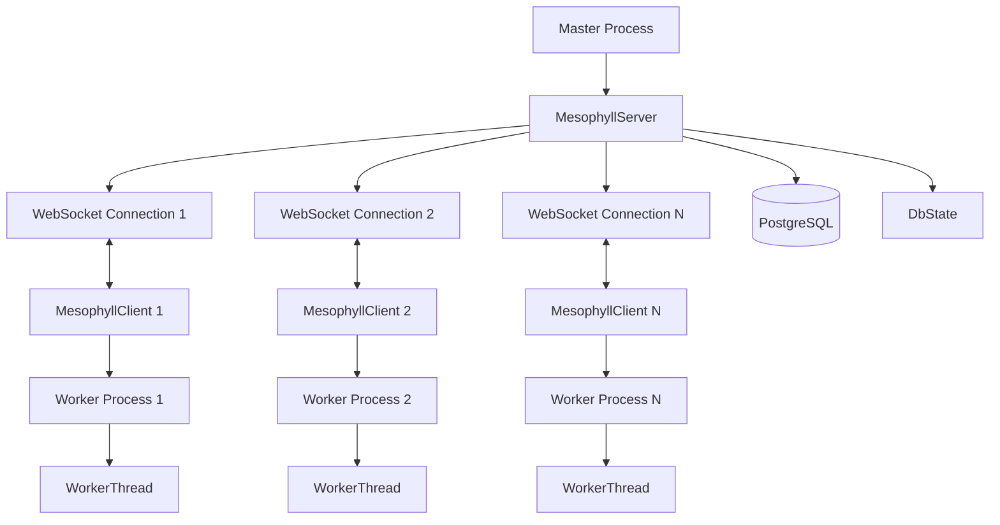

## Overview

Mesophyll is the coordination layer that enables communication between the master process and worker processes in the Template Worker system. It replaces the older HTTP/2-based WorkerProcessComm system with a more flexible WebSocket protocol.

<Info>
**Name Origin**: In plant biology, mesophyll is the internal tissue of a leaf that contains chloroplasts and performs photosynthesis. Similarly, Mesophyll in Template Worker is the "internal tissue" that enables the system to function by coordinating between components.
</Info>

Reference: src/mesophyll/mod.rs:1-18

## Architecture



## MesophyllServer

The `MesophyllServer` runs in the master process and manages connections from all worker processes.

### Structure

```rust
pub struct MesophyllServer {
    idents: Arc<HashMap<usize, String>>,
    conns: Arc<DashMap<usize, MesophyllServerConn>>,
    db_state: DbState,
}
```

Reference: src/mesophyll/server.rs:15-20

### Components

- **idents**: Maps worker IDs to authentication tokens (64-character random strings)
- **conns**: Active WebSocket connections indexed by worker ID
- **db_state**: Shared database state for all workers

### Initialization

The server generates unique tokens for each worker:

```rust
pub async fn new(addr: String, num_idents: usize, pool: sqlx::PgPool) -> Result<Self, crate::Error> {
    let mut idents = HashMap::new();
    for i in 0..num_idents {
        let ident = Alphanumeric.sample_string(&mut rand::rng(), Self::TOKEN_LENGTH);
        idents.insert(i, ident);
    }
    Self::new_with(addr, idents, pool).await
}
```

Reference: src/mesophyll/server.rs:25-32

### HTTP API

Mesophyll exposes several HTTP/2 endpoints for worker communication:

```rust
let app = Router::new()
    .route("/ws", get(ws_handler))
    .route("/db/tenant-states", get(list_tenant_states))
    .route("/db/tenant-state", post(set_tenant_state_for))
    .route("/db/kv", post(kv_handler))
    .route("/db/public-global-kv", post(public_global_kv_handler))
    .route("/db/global-kv", post(global_kv_handler))
    .with_state(s.clone());
```

Reference: src/mesophyll/server.rs:42-48

<AccordionGroup>
  <Accordion title="/ws - WebSocket Upgrade">
    Upgrades HTTP connection to WebSocket for real-time communication.
    
    **Query Parameters:**
    - `id`: Worker ID
    - `token`: Authentication token
    
    **Validation**: Token must match the expected token for the worker ID.
  </Accordion>
  
  <Accordion title="/db/tenant-states - List Tenant States">
    Returns all tenant states assigned to a specific worker.
    
    Used during worker initialization to populate the tenant state cache.
    
    Reference: src/mesophyll/server.rs:103-112
  </Accordion>
  
  <Accordion title="/db/tenant-state - Set Tenant State">
    Updates the state for a specific tenant.
    
    **Query Parameters:**
    - `tenant_type`: "guild" or "user"
    - `tenant_id`: Tenant identifier
    
    **Body**: MessagePack-encoded `TenantState`
    
    Reference: src/mesophyll/server.rs:135-161
  </Accordion>
  
  <Accordion title="/db/kv - Key-Value Operations">
    Performs key-value operations (get, set, delete, find) for tenant-scoped data.
    
    **Body**: MessagePack-encoded `KeyValueOp`
    
    Reference: src/mesophyll/server.rs:164-230
  </Accordion>
  
  <Accordion title="/db/public-global-kv - Public Global KV">
    Read-only access to global key-value data (template shop, etc.).
    
    Reference: src/mesophyll/server.rs:233-267
  </Accordion>
  
  <Accordion title="/db/global-kv - Global KV Management">
    Create and delete global key-value entries.
    
    Reference: src/mesophyll/server.rs:270-309
  </Accordion>
</AccordionGroup>

## MesophyllServerConn

Represents a single WebSocket connection from a worker to the server.

### Structure

```rust
pub struct MesophyllServerConn {
    id: usize,
    send_queue: UnboundedSender<Message>,
    query_queue: UnboundedSender<MesophyllServerQueryMessage>,
    dispatch_response_handlers: Arc<DashMap<u64, Sender<Result<KhronosValue, String>>>>,
    cancel: CancellationToken,
}
```

Reference: src/mesophyll/server.rs:344-351

### Message Dispatching

The server can dispatch events to workers and wait for responses:

```rust
pub async fn dispatch_event(&self, id: Id, event: CreateEvent) -> Result<KhronosValue, crate::Error> {
    let (req_id, rx) = self.register_dispatch_response_handler();
    let _guard = DispatchHandlerDropGuard::new(&self.dispatch_response_handlers, req_id);
    
    let message = ServerMessage::DispatchEvent { id, event, req_id: Some(req_id) };
    self.send(&message)?;
    Ok(rx.await.map_err(|e| format!("Failed to receive dispatch event response: {}", e))??)
}
```

Reference: src/mesophyll/server.rs:472-481

<Info>
**Request Tracking**: Each request gets a unique 64-bit random ID to correlate requests with responses. The `DispatchHandlerDropGuard` ensures handlers are cleaned up even if the future is dropped.
</Info>

## MesophyllClient

The `MesophyllClient` runs in worker processes and maintains a WebSocket connection to the server.

### Structure

```rust
pub struct MesophyllClient {
    wt: Arc<WorkerThread>,
    addr: String,
}
```

Reference: src/mesophyll/client.rs:11-15

### Connection Management

The client automatically reconnects on disconnect:

```rust
tokio::task::spawn(async move {
    loop {
        if let Err(e) = self_ref.handle_task().await {
            log::error!("Mesophyll client task error: {}", e);
        }
        
        log::debug!("Mesophyll client reconnecting in 5 seconds...");
        tokio::time::sleep(Duration::from_secs(5)).await;
    }
});
```

Reference: src/mesophyll/client.rs:28-38

### Message Processing

The client processes incoming messages in a select loop:

```rust
loop {
    tokio::select! {
        Some(Ok(msg)) = stream_rx.next() => {
            match server_msg {
                ServerMessage::Hello { heartbeat_interval_ms } => {
                    hb_timer = interval(Duration::from_millis(heartbeat_interval_ms));
                }
                ServerMessage::DispatchEvent { id, event, req_id } => {
                    let fut = self.wt.dispatch_event(id, event);
                    dispatches.push(async move { (req_id, fut.await) });
                },
                ServerMessage::RunScript { id, name, code, event, req_id } => {
                    let fut = self.wt.run_script(id, name, code, event);
                    script_runs.push(async move { (req_id, fut.await) });
                },
                ServerMessage::DropWorker { id, req_id } => {
                    let resp = self.wt.drop_tenant(id).await;
                    // Send response...
                }
            }
        }
        Some((req_id, result)) = dispatches.next() => {
            // Send dispatch response...
        }
        _ = hb_timer.tick() => {
            // Send heartbeat...
        }
    }
}
```

Reference: src/mesophyll/client.rs:50-121

## Message Protocol

Mesophyll uses MessagePack encoding for efficient binary serialization.

### Server Messages

```rust
pub enum ServerMessage {
    Hello { heartbeat_interval_ms: u64 },
    DispatchEvent { id: Id, event: CreateEvent, req_id: Option<u64> },
    RunScript { id: Id, name: String, code: String, event: CreateEvent, req_id: u64 },
    DropWorker { id: Id, req_id: u64 },
}
```

<AccordionGroup>
  <Accordion title="Hello">
    Sent by server upon connection to configure heartbeat interval.
    
    Default: 5000ms (MESOPHYLL_DEFAULT_HEARTBEAT_MS)
  </Accordion>
  
  <Accordion title="DispatchEvent">
    Requests worker to dispatch an event to a tenant's VM.
    
    - `req_id: Some(id)`: Wait for response
    - `req_id: None`: Fire-and-forget
  </Accordion>
  
  <Accordion title="RunScript">
    Requests worker to execute arbitrary Luau code.
    
    Used by Fauxpas staff API.
  </Accordion>
  
  <Accordion title="DropWorker">
    Requests worker to drop a tenant's VM and clean up resources.
  </Accordion>
</AccordionGroup>

### Client Messages

```rust
pub enum ClientMessage {
    Heartbeat {},
    DispatchResponse { req_id: u64, result: Result<KhronosValue, String> },
}
```

- **Heartbeat**: Sent periodically to keep connection alive
- **DispatchResponse**: Response to DispatchEvent, RunScript, or DropWorker

## MesophyllDbClient

Workers use `MesophyllDbClient` to access database operations via HTTP/2:

```rust
pub struct MesophyllDbClient {
    addr: String,
    worker_id: usize,
    token: String,
    client: reqwest::Client,
}
```

Reference: src/mesophyll/client.rs:126-131

### Database Operations

<Tabs>
  <Tab title="Tenant State">
    ```rust
    // List all tenant states for this worker
    pub async fn list_tenant_states(&self) -> Result<HashMap<Id, TenantState>, crate::Error>
    
    // Update tenant state
    pub async fn set_tenant_state_for(&self, id: Id, state: &TenantState) -> Result<(), crate::Error>
    ```
    
    Reference: src/mesophyll/client.rs:195-216
  </Tab>
  
  <Tab title="Key-Value Store">
    ```rust
    pub async fn kv_get(&self, id: Id, scopes: Vec<String>, key: String) -> Result<Option<SerdeKvRecord>, crate::Error>
    pub async fn kv_set(&self, id: Id, scopes: Vec<String>, key: String, value: KhronosValue) -> Result<(), crate::Error>
    pub async fn kv_delete(&self, id: Id, scopes: Vec<String>, key: String) -> Result<(), crate::Error>
    pub async fn kv_find(&self, id: Id, scopes: Vec<String>, prefix: String) -> Result<Vec<SerdeKvRecord>, crate::Error>
    pub async fn kv_list_scopes(&self, id: Id) -> Result<Vec<String>, crate::Error>
    ```
    
    Reference: src/mesophyll/client.rs:218-276
  </Tab>
  
  <Tab title="Global Key-Value">
    ```rust
    pub async fn global_kv_find(&self, scope: String, query: String) -> Result<Vec<PartialGlobalKv>, crate::Error>
    pub async fn global_kv_get(&self, key: String, version: i32, scope: String, id: Option<Id>) -> Result<Option<GlobalKv>, crate::Error>
    pub async fn global_kv_create(&self, id: Id, entry: CreateGlobalKv) -> Result<(), crate::Error>
    pub async fn global_kv_delete(&self, id: Id, key: String, version: i32, scope: String) -> Result<(), crate::Error>
    ```
    
    Global KV is used for the template shop and cross-tenant data sharing.
    
    Reference: src/mesophyll/client.rs:278-322
  </Tab>
</Tabs>

## WorkerDB Abstraction

The `WorkerDB` enum provides a unified interface for database access:

```rust
pub enum WorkerDB {
    Direct(DbState),
    Mesophyll(MesophyllDbClient)
}
```

Reference: src/worker/workerdb.rs:7-10

This abstraction allows:
- **Thread Pool Mode**: Direct database access via `DbState`
- **Process Pool Mode**: Database access via Mesophyll HTTP/2 API
- **Transparent Switching**: Application code doesn't need to know which mode is used

Example usage:

```rust
impl WorkerDB {
    pub async fn kv_get(&self, id: Id, scopes: Vec<String>, key: String) -> Result<Option<SerdeKvRecord>, crate::Error> {
        match self {
            WorkerDB::Direct(d) => d.key_value_db().kv_get(id, scopes, key).await,
            WorkerDB::Mesophyll(c) => c.kv_get(id, scopes, key).await,
        }
    }
}
```

Reference: src/worker/workerdb.rs:28-33

## Heartbeat System

Mesophyll uses heartbeats to detect disconnected workers:

```rust
const MESOPHYLL_DEFAULT_HEARTBEAT_MS: u64 = 5000;

let mut hb_timer = interval(Duration::from_millis(heartbeat_interval_ms));

loop {
    tokio::select! {
        _ = hb_timer.tick() => {
            let heartbeat = encode_message(&ClientMessage::Heartbeat {})?;
            stream_tx.send(heartbeat).await?;
        }
    }
}
```

Reference: src/mesophyll/mod.rs:18, src/mesophyll/client.rs:115-119

The server tracks the last heartbeat time:

```rust
pub async fn get_last_hb_instant(&self) -> Result<Option<Instant>, crate::Error>
```

Reference: src/mesophyll/server.rs:517-521

## Security Model

### Authentication

1. Master generates 64-character random token for each worker
2. Token passed via environment variable `MESOPHYLL_CLIENT_TOKEN` (src/main.rs:436)
3. Worker includes token in WebSocket upgrade and HTTP requests
4. Server validates token before accepting connection

Reference: src/mesophyll/server.rs:84-99

### Token Generation

```rust
const TOKEN_LENGTH: usize = 64;

for i in 0..num_idents {
    let ident = Alphanumeric.sample_string(&mut rand::rng(), Self::TOKEN_LENGTH);
    idents.insert(i, ident);
}
```

Reference: src/mesophyll/server.rs:23-29

<Warning>
**Security Note**: Mesophyll is designed for internal communication only. It binds to a local address and should not be exposed to the internet. The token system prevents worker spoofing but assumes network security.
</Warning>

## Future Enhancements

From the module documentation:

> In the future, it is a goal for Mesophyll to be a base unit of sandboxing as well through projects like khronos dapi

Planned improvements:
- Enhanced sandboxing capabilities
- Multi-master support for high availability
- Worker-to-worker direct communication
- Template shop update broadcasts

Reference: src/mesophyll/mod.rs:9-10

## Performance Characteristics

- **Protocol**: WebSocket (persistent connections) + HTTP/2 (database operations)
- **Serialization**: MessagePack (efficient binary format)
- **Connection Pooling**: reqwest HTTP/2 client with prior knowledge
- **Message Pattern**: Request-response with async correlation
- **Reconnection**: Automatic with exponential backoff

## Next Steps

<CardGroup cols={2}>
  <Card title="Worker System" href="/architecture/worker-system" icon="gears">
    Understand how workers use Mesophyll
  </Card>
  
  <Card title="Components" href="/architecture/components" icon="cubes">
    Explore other system components
  </Card>
</CardGroup>