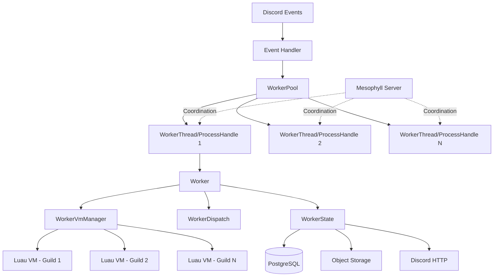

## Introduction

The Template Worker is the core execution engine of AntiRaid, responsible for running Luau templates in response to Discord events. The architecture is designed around single-responsibility components that work together through well-defined interfaces.

## Core Design Philosophy

The worker architecture follows a key principle:

<Note>
**Single Responsibility Principle**: Each layer does one thing well and stores only the components it needs as struct fields. This eliminates the entanglement issues present in older AntiRaid versions.
</Note>

## System Architecture



## Component Layers

The worker system is composed of multiple focused layers:

### Core Worker Components

- **WorkerLike**: Trait defining the basic interface for worker units
- **WorkerPool**: Pools multiple workers using Discord's sharding formula for distribution
- **WorkerThread**: Single-threaded worker topology using tokio channels
- **WorkerProcessHandle**: Process-based worker topology for isolation
- **Worker**: Encapsulates VM management and event dispatching

### Execution Layer

- **WorkerVmManager**: Manages Luau VM lifecycle per guild/user
- **WorkerDispatcher**: Dispatches events to VMs and handles execution lifecycle
- **VMContext**: Provides template context and data access to Luau runtime

### State Management

- **WorkerState**: Shared state across all VMs (HTTP client, database, object storage)
- **WorkerDB**: Database abstraction supporting direct and Mesophyll access
- **WorkerCacheData**: Caches templates and key expiry data

### Supporting Systems

- **Mesophyll**: Coordination layer for inter-worker communication
- **Builtins**: Embedded VFS with core Luau libraries and Discord commands
- **Limits**: Resource constraints and GCRA rate limiters
- **Geese**: Utility components (object storage, sandwich, key-value store)
- **Fauxpas**: Staff API and administrative tools

Refer to src/main.rs:1-493 for the system initialization flow.

## Data Flow

### Event Dispatch Flow

1. **Event Reception**: Discord event arrives via Serenity
2. **Worker Selection**: Event routed to appropriate worker using `(guild_id >> 22) % num_workers` (src/worker/workervmmanager.rs:69-77)
3. **Tenant Check**: Worker checks if event is registered for tenant (src/worker/workerdispatch.rs:75-81)
4. **VM Acquisition**: WorkerVmManager gets or creates VM for tenant (src/worker/workervmmanager.rs:118-128)
5. **Script Execution**: WorkerDispatch runs template in Luau VM (src/worker/workerdispatch.rs:72-111)
6. **Response**: Result returned through the worker chain

### Worker Topologies

The system supports two execution topologies:

<CardGroup cols={2}>
  <Card title="Thread Pool" icon="layer-group">
    **WorkerThread**: Workers run in separate threads with tokio channels for communication. Lightweight and fast, suitable for development.
    
    Reference: src/worker/workerthread.rs:1-175
  </Card>
  
  <Card title="Process Pool" icon="server">
    **WorkerProcessHandle**: Workers run in separate processes coordinated via Mesophyll WebSocket protocol. Provides isolation and fault tolerance.
    
    Reference: src/worker/workerprocesshandle.rs:1-208
  </Card>
</CardGroup>

## Sharding and Distribution

The worker pool uses Discord's official sharding formula:

```rust
shard_id = (guild_id >> 22) % num_shards
```

This ensures:
- Consistent routing of guild events to the same worker
- Even distribution across workers
- Deterministic VM assignment
- State locality (all events for a guild hit the same VM)

See src/worker/workervmmanager.rs:68-78 for the implementation.

## Isolation Model

### Thread Pool Mode

- Each WorkerThread runs in its own OS thread with a dedicated stack (src/worker/limits.rs defines MAX_VM_THREAD_STACK_SIZE)
- Uses tokio `LocalRuntime` for !Send futures
- Panic isolation: thread panics abort the process (src/worker/workerthread.rs:104-107)
- Communication via unbounded mpsc channels

### Process Pool Mode

- Each worker runs as a separate process
- Master process spawns workers and manages lifecycle (src/worker/workerprocesshandle.rs:53-136)
- Automatic restart on worker failure with backoff
- Coordinated via Mesophyll WebSocket protocol
- Process crashes are isolated from master

## Configuration

Worker type is configured via command-line arguments:

```bash
# Thread pool mode (default)
./template-worker --worker-type threadpool

# Process pool mode
./template-worker --worker-type processpool

# Individual process worker (spawned by master)
./template-worker --worker-type processpoolworker --worker-id 0
```

See src/main.rs:35-55 for all worker types.

## Next Steps

<CardGroup cols={2}>
  <Card title="Worker System" href="/architecture/worker-system" icon="gears">
    Deep dive into WorkerLike, pools, and topologies
  </Card>
  
  <Card title="Mesophyll" href="/architecture/mesophyll" icon="network-wired">
    Learn about the coordination layer
  </Card>
  
  <Card title="Components" href="/architecture/components" icon="cubes">
    Detailed component breakdown
  </Card>
</CardGroup>